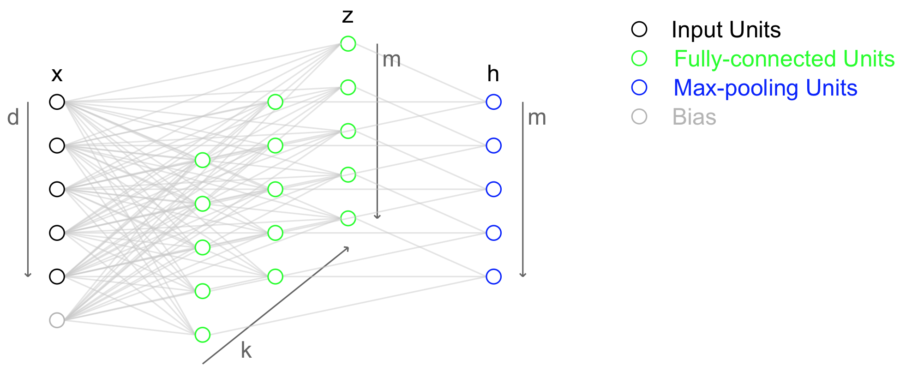

# Convolutional Neural Network

## Problem of Classic Neural Network
>- Overfitting due to increasing complexity of the network by deep structure

## Main Idea
>- Sparse interaction
>- Parameter sharing
>- Equivariant representation (on shift, not on rotate)

## Important Techniques for CNN
### ReLU (Rectified Liner Unit)
>- Activation function $(f(x)=\max(0,x))$ used instead of sigmoid function
>- Pros
>    - Quick convergence with stochastic gradient descent compared to sigmoid
>    - Cheap computation cost compared to sigmoid
>- Cons
>    - ??

### Dropout
>- For each mini-batch, some neurons are turned off
>    - Voting effect
>        - Each group of neurons off together is a simplified network itself
>        - Each simplified network experiences overfitting
>        - But, by a number of such simplified networks trained by different mini-batchs, a result of the entire network has averaging effect
>- Effect
>    - Activations of neurons tend to be sparse
>    - Salient features are extracted because co-adaptation is prevented
>    - Especially good with max-norm ($\Vert w\Vert_2 \leq c$ for a constant $c$)
>    - Averaging effect by multiple sub-models for softmax functions in theory (i.e. only for the output layer)
>- How to work?
>    - **When training**
>        - Each neuron is turned on with probability $p$
>    - **When testing**
>        - Output is determined with weights multiplied by the probability $p$ that the corresponding neurons are not dropped out

### DropConnect
>- Generalization of Dropout
>    - Some weights are omitted instead of neurons
>        - Omitting a neuron can be understood as omitting all weights connected to that neuron

### Stochastic Pooling
>- Usually average pooling or max pooling is used
>    - Averaging operation is affected by many $0$ by ReLU, or canceled by negative and positive values by sigmoid
>    - Max operations may result in overfitting to training data
>- Stochastic pooling keeps the advantage of max pooling while avoiding overfitting
>- How to work?
>    - **When training**
>        - Values in a pooling window are normalized by their sum
>        - Final activation is chosen among all values with their probabilities, normalized values
>    - **When testing**
>        - Expectation is used with respect to their probabilities, which are the same as those calculated for training

### Maxout
>- Activation function that maximizes the effect of  Dropout
>- How to work?
>    - 
>    - For each hidden unit, there are corresponding $k$ number of Maxout units connected to the previous layer
>        - Hidden unit is not directely connected to the previous layer
>    - Each Maxout unit outputs linear combination of outputs of the previous layer with the corresponding weights
>        - Same as behavior of hidden unit in classic neural network with identity activation function
>    - Each hidden unit outputs the maximum value of its corresponding Maxout units
>    - Refer to [Maxout animation](http://www.simon-hohberg.de/2015/07/19/maxout.html)

### Batch Normalization
>- Resolving vanishing/exploding gradient (+ regularization effect)
>- ???

### Residual Learning
>- Resolving vanishing/exploding gradient
>- Given input x and desired output $H(x)$, training is done to obtain $F(x) = H(x) - x$
>- This way makes the training toward $F(x) = 0$
>    - Small fluctuation can be detected
